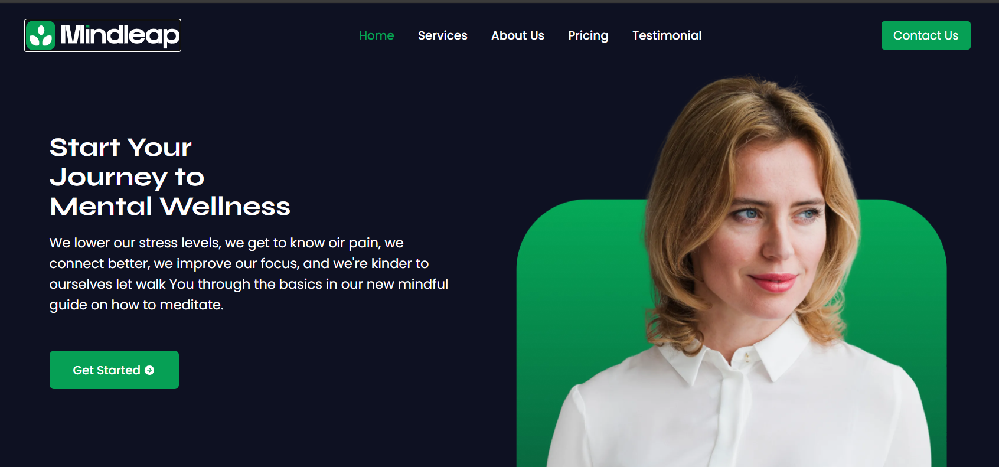

# 🧠 Mental Wellness Landing Page

A modern, responsive and animated landing page for a **Mental Wellness Platform**, built using **React.js**, **Tailwind CSS**, and **Framer Motion**. This project is designed to provide users a smooth, calming and engaging experience to explore therapy and self-help services.

### 🔗 Live Demo
👉 [Visit Live Site](https://mental0-wellness-lending-page.vercel.app/)

---

## ✨ Features

- 🎨 Beautiful and responsive design with Tailwind CSS
- 🚀 Fully mobile-first layout and accessibility support
- 🔄 Animated sections using Framer Motion
- 🎥 Interactive video thumbnail with modal video play
- 🧾 Reusable components: Hero, Services, How It Works, About, Contact
- 📝 Firebase-integrated contact form for booking appointments
- 📍 Smooth scroll navigation
- 📸 Optimized assets and illustrations
- 🔒 Form validations and error handling

## 🖼️ UI Preview



---

## 🛠️ Technologies Used

React.js – Component-based UI library

Tailwind CSS – Utility-first CSS framework

Framer Motion – React animations

Firebase – For contact form submission

Vite – Fast development server

---

## 📦 Installation

### Clone the repository

```bash
git clone https://github.com/Inshiya1904/Mental-wellness-lendingPage.git
cd Mental-wellness-lendingPage
```

### Install dependencies

```bash
npm install
```

### Start the app

```bash
npm run dev
```
